# ALGORITHMS

## Directory Contents:
1) [Navigation](#navigation)
2) [Introduction To Algorithms](#introduction-to-algorithms)
    - [Properties Of Algorithms](#properties-of-an-algorithm)
3) [RAM Model Of Computation](#ram-model-of-computation)
    - [Effectiveness Of The RAM Model](#effectiveness-of-the-ram-model)
    - [Case Complexity Of Algorithms](#case-complexity-of-algorithms)
    - [Algorithmic Efficiency](#algorithmic-efficiency)
    - [Algorithmic Correctness](#algorithmic-correctness)
    - [Classification Of Algorithms](#classifying-algorithms-by)
4) [Big Oh Notation](#big-oh-notation)
    - [Formal Definitions For The Big Notations](#formal-definitions-for-the-big-notations)
    - [Big Theta Problems](#big-theta-problems)
5) [Growth Rates & Dominance Relations](#growth-rates--dominance-relations)
6) [Big Oh Addition & Multiplication](#big-oh-addition--multiplication)
    - [Adding Functions](#adding-functions)
    - [Mutiplying Functions](#multiplying-functions)
7) [Reasoning About Efficiency](#reasoning-about-efficiency)
8) [Logarithmic Runtimes](#logarithmic-runtimes)
    - [Logarithmic Rules](#logarithmic-rules)
    - [Common Logarithmic Powers](#common-logarithmic-powers)
    - [Logarithms & Algorithmic Observations](#logarithms--algorithmic-observations)

## Navigation:
1. [Basic Searching](https://github.com/Zero-Luminance/ads-c/tree/main/algorithms/basic-searching):
    - Linear Search
    - Binary Search
2. [Basic Sorting](https://github.com/Zero-Luminance/ads-c/tree/main/algorithms/basic-sorting):
    - Bubblesort
    - Mergesort
    - Heapsort
    - Quicksort
    - Distribution Sort
    - Radix Sort
    - Bucket Sort

## Introduction To Algorithms:
- ***‘Algorithms’*** are a set of specific _STEPS_ to complete a problem
- ***‘Problems’*** specifies _BOTH_ the set _INFORMATION_ an algorithms works with (i.e. domain) & the _OUTPUT_ produced
    - ***‘Class Problem’*** refers type of the type of the task (e.g. sorting, searching, etc)
    - ***‘Instance Of A Problem’*** is a real life example of a class problem (e.g. accessing information using key:value pairs is a type of sorting)
<figure>
    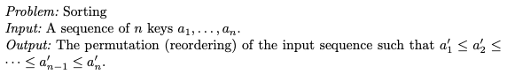
    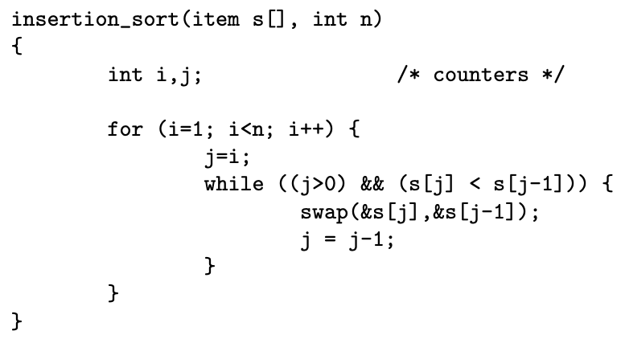
    <figcaption>Source: <a href="https://www.algorist.com/">The Algorithm Design Manual</a> (Pages 3 & 4), Steven S. Skiena</figcaption>
</figure>

### Properties Of Algorithms:
- ***‘Correctness’*** refers to whether one can predict input-output behaviour & is demonstrated through mathematical _PROOFS_
- ***‘Efficiency’*** refers to the amount of _RESOURCES_ (i.e. memory & time) an algorithm consumes to complete a task & can be measured using both the:
    1. _RAM_ Model Of Computation
    2. Worst Case Asymptotic Complexity
- ***‘Ease Of Implementation’*** refers to the actual _PROGRAMMING_ of an algorithm & it’s difficulty to deploy

## RAM Model Of Computation:
- ***‘RAM (Random Access Memory) Model Of Computation’*** measures the runtime (i.e. ***‘efficiency’***) of an algorithm by summing up the total number of steps needed to execute an algorithm on a set of data
- _RAM_ Model Assumptions:
<table>
    <tr>
        <th scope="col">OPERATION:</th>
        <th scope="col">NUMBER OF STEPS:</th>
    </tr>
    <tr>
        <td>Simple (+, -, * , = , if, call)</td>
        <td>1</td>
    </tr>
    <tr>
        <td>Loops & Subroutines</td>
        <td>number of iterations</td>
    </tr>
    <tr>
        <td>Memory Access (cache or disk)</td>
        <td>1</td>
    </tr>
</table>
 

### Effectiveness Of The RAM Model:
<table>
    <tr>
        <th scope="col">ADVANTAGES:</th>
        <th scope="col">DISADVANTAGES:</th>
    </tr>
    <tr>
        <td><b>‘Simple’</b> model to understand</td>
        <td><i>RAM</i> Model Assumptions are <i>NOT</i> always right (e.g. + takes more steps than *)</td>
    </tr>
    <tr>
        <td>Highlights the <b>‘essential concepts’</b> of how computers work</td>
        <td>&nbsp</td>
    </tr>
</table>
 

### Case Complexity Of Algorithms:
- ***‘Complexity Of An Algorithm’*** is the EXACT function that describes how many steps (y-axis) an algorithm takes to complete a task with ’n’ inputs (x-axis)
    - ***‘Worst-Case Complexity’*** is a function that defines the _MAXIMUM_ number of steps taken in any instance of size ***’n'***
    - ***‘Best-Case Complexity’*** is a function that defines the _MINIMUM_ number of steps taken in any instance of size ***’n'***
    - ***‘Average-Case Complexity’*** is a function that defines the _AVERAGE_ number of steps over all instances of size ***’n’***
- ***RULE***: worst case complexity is the most useful as it provides a guaranteed period of time the algorithm will finish executing
<figure>
    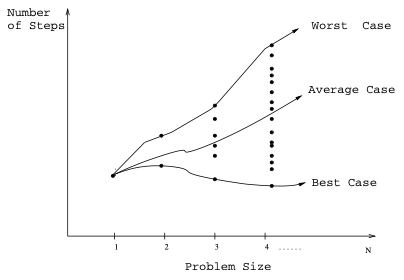
    <figcaption>Source: The Algorithm Design Manual (Page 35), Steven S. Skiena</figcaption>
</figure>

### Algorithmic Efficiency:
- ***‘Efficiency’*** is a measurement of how space/time requirements of an algorithm scale with the input
- ***‘Time Complexity’*** mathematical function that describes the amount of time needed for algorithm to complete in relation to input size
- ***’Space Complexity’*** mathematical function that describes the amount memory space used by an algorithm in relation to input size
- ***‘Big O Notation’*** is a mathematic representation of how many operations is needed to solve a problem of a certain input size & is expressed as:

<figure>
    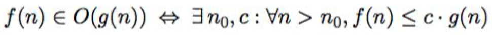
    <figcaption>Source: Programming, Problem Solving & Abstraction With C (Page 204), Alistair Moffat</figcaption>
</figure>

- ***‘n’*** represents the input _SIZE_ of a problem
- ***‘f(n)’*** represents the _ENTIRE_ equation of an algorithm
- ***‘g(n)’*** (asymptotic equation) represents the _FAMILY_ of equations ***f(n)*** belongs to

### Algorithmic Correctness:
- ***‘Correct’*** algorithms returns the desired output _EVERY_ time, for every possible (legal) input
- Faster to prove an incorrect algorithm than opposite
- ***NOTE***: some algorithms opt to sacrifice correctness for speed

### Classifying Algorithms By:
<table>
    <tr>
        <th scope="col">TASK:</th>
        <th scope="col">APPROACH:</th>
        <th scope="col">SOLUTION TYPE:</th>
    </tr>
    <tr>
        <td><b>‘Numeric’</b> involves computation involving numeric values</td>
        <td><b>‘Brute Force’</b> relies on computing power to check every possibility for a solution</td>
        <td><b>‘Exact’</b> involves looking for a precise answer</td>
    </tr>
    <tr>
        <td><b>‘Sorting’</b> involves organising items under condition(s)</td>
        <td><b>‘Divide & Conquer’</b> involves splitting an issue into smaller parts that contribute holistically</td>
        <td><b>‘Approximate’</b> involves looking for the best possible closest answer</td>
    </tr>
    <tr>
        <td><b>‘Searching’</b> involves looking for stored values</td>
        <td><b>‘Greedy’</b> involves taking the currently best looking option</td>
        <td><b>‘Heuristic’</b> involves solving a problem by prioritising speed over accuracy & answer correctness</td>
    </tr>
    <tr>
        <td><b>‘Routing’</b> involves looking for a path under condition(s)</td>
        <td>&nbsp</td>
        <td>&nbsp</td>
    </tr>
</table>
 

## Big Oh Notation:
- ***‘Big Oh Notation’*** is a function that only takes the _HIGHEST_ order term from the complexity function (e.g. ***n2*** from ***T(n) = 7n2 + 1***)
- ***AIM***: Simplify complexity functions in terms of _UPPER_ (i.e. worst case) & _LOWER_ (i.e. best case) bounded functions
<figure>
    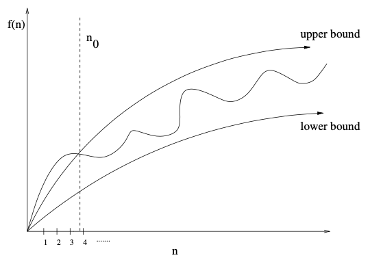
    <figcaption>Source: The Algorithm Design Manual (Page 35), Steven S. Skiena</figcaption>
</figure>

### Formal Definitions For The Big Notations:
- ***‘Big Oh’*** is the _UPPER_ bound of the exact complexity
<figure>
    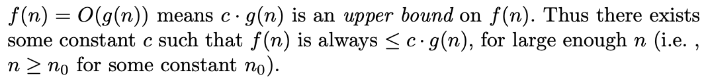
    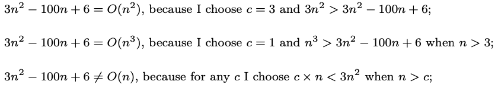
    <figcaption>Source: The Algorithm Design Manual (Page 35 & 36), Steven S. Skiena</figcaption>
</figure>
- ***‘Big Omega’*** is the _LOWER_ bound of the exact complexity
<figure>
    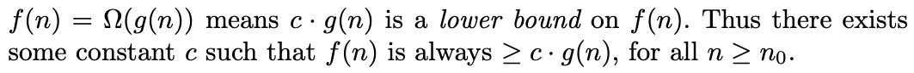
    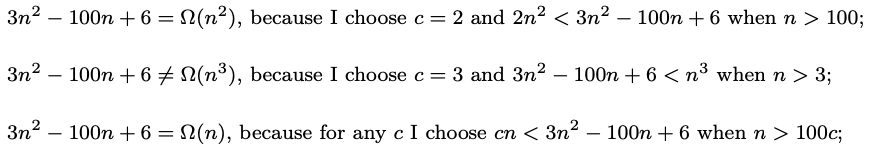
    <figcaption>Source: The Algorithm Design Manual (Page 35 & 36), Steven S. Skiena</figcaption>
</figure>
- ***‘Big Theta’*** provides a _BOTH_ bounds _AROUND_ the exact complexity
<figure>
    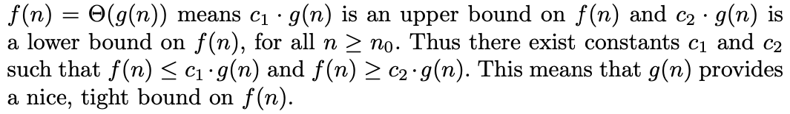
    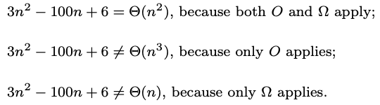
    <figcaption>Source: The Algorithm Design Manual (Page 35 & 36), Steven S. Skiena</figcaption>
</figure>

### Graphing Algorithmic Complexity Bounds:
<figure>
    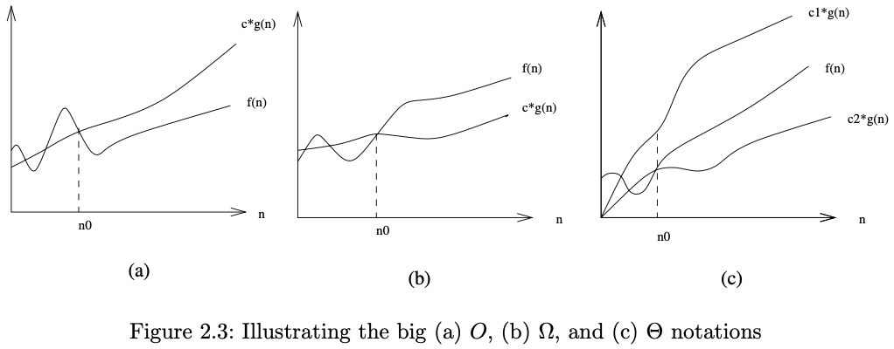
    <figcaption>Source: The Algorithm Design Manual (Page 36), Steven S. Skiena</figcaption>
</figure>

### Big Theta Problems:
<figure>
    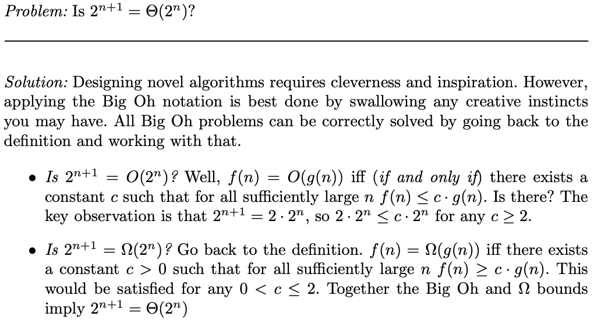
    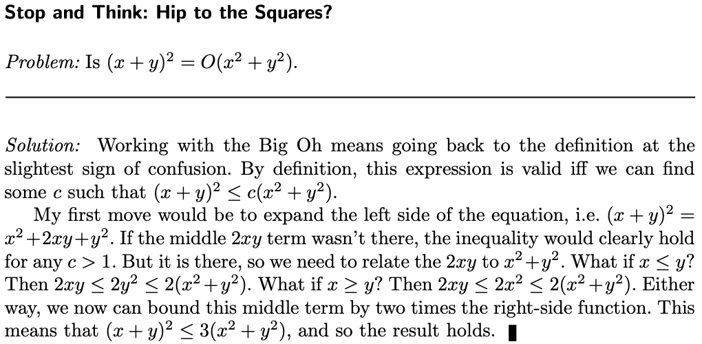
    <figcaption>Source: The Algorithm Design Manual (Page 36), Steven S. Skiena</figcaption>
</figure>

## Growth Rates & Dominance Relations:
### Growth Rates:
- ***‘Growth Rates’*** involve Big Oh functions that specifies the amount of time needed to run an algorithm given an input size
- Common Functions & Their Growth Rates:
<figure>
    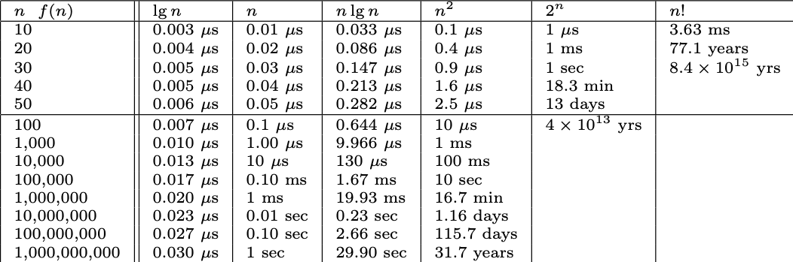
    <figcaption>Source: The Algorithm Design Manual (Page 38), Steven S. Skiena</figcaption>
</figure>

### Dominance Relations:
Using Big Oh:
- Functions of the _SAME CLASS_ are considered ***Ø(n)***; Big Theta (e.g. ***f(n)=0.29n*** & ***f(n)=117n***)
- Functions of a _DIFFERENT CLASS_ are considered ***O(n)***; Big Oh (i.e. either ***f(n)=O(g(n)***) meaning ***g>>f***, or ***g(n)=O(f(n))*** meaning ***f>>g***, but _NEVER_ both; one of the functions is bound to _DOMINATE_ the other)
- Classifying Common Functions:
<table>
    <tr>
        <th scope="col">FUNCTION:</th>
        <th scope="col">DESCRIPTION:</th>
    </tr>
    <tr>
        <td>Constant - <b>f(n)=c</b></td>
        <td><i>NO</i> dependence on the parameter <b>‘c’</b> & is commonly associated with basic operations (i.e. adding, if statements, etc)</td>
    </tr>
    <tr>
        <td>Logarithmic - <b>f(n)=log(n)</b></td>
        <td>Appears with binary search algorithms; grows <i>SLOWLY</i></td>
    </tr>
    <tr>
        <td>Linear - <b>f(n)=n</b></td>
        <td>Applies to problems when looking at <i>EVERY</i> item at least <b>’n’</b> times (e.g. linear search)</td>
    </tr>
    <tr>
        <td>Superlinear - <b>f(n)=nlog(n)</b></td>
        <td>Appears in Quick-sort & Merge-sort algorithms </td>
    </tr>
    <tr>
        <td>Quadratic - <b>f(n)=n^2</b></td>
        <td>Typical when searching through most or all <i>PAIRS</i> of <b>’n’</b> items</td>
    </tr>
    <tr>
        <td>Cubic - <b>f(n)=n^3</b></td>
        <td>Typical when searching through most or all <i>TRIPLETS</i> of <b>’n’</b> items (e.g. insertion & selection sort)</td>
    </tr>
    <tr>
        <td>Exponential - <b>f(n)=c^n</b></td>
        <td>For <b>c > 1</b>, common with enumerating subsets of <b>’n’</b> items</td>
    </tr>
    <tr>
        <td>Factorial - <b>f(n)=n!</b></td>
        <td>Typical for generating permutations or orderings of <b>’n’</b> items</td>
    </tr>
</table>
<figure>
    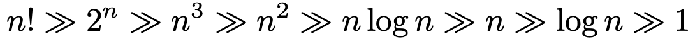
    <figcaption>Source: The Algorithm Design Manual (Page 40), Steven S. Skiena</figcaption>
</figure>

## Big Oh Addition & Multiplication:
### Adding Functions:
- ***‘Addition’*** of two functions is governed by the dominant function (i.e. lower order functions are _REMOVED_ & _IGNORED_):
<figure>
    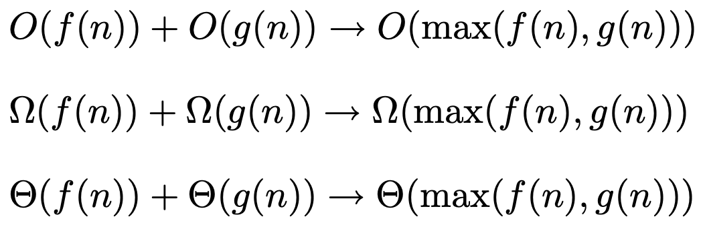
    <figcaption>Source: The Algorithm Design Manual (Page 40), Steven S. Skiena</figcaption>
</figure>
- ***LOGIC***: as ***n->∞*** the dominant function contributes the _MOST_ growth in the dominance relation
- The sum between functions of the _SAME CLASS_ results in the Big Oh of said class
<figure>
    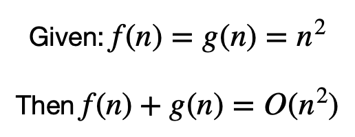
    <figcaption>Source: The Algorithm Design Manual (Page 40), Steven S. Skiena</figcaption>
</figure>

### Multiplying Functions:
- ***‘Constant Multiplication’*** results in the multiplying term, the ***‘c’***, being _IGNORED_ & _REMOVED_ (strictly assuming ***c > 1***):
<figure>
    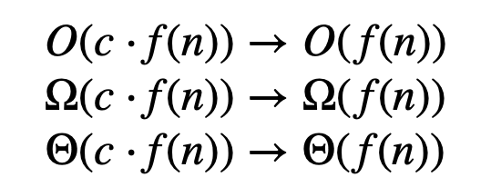
    <figcaption>Source: The Algorithm Design Manual (Page 40), Steven S. Skiena</figcaption>
</figure>
- ***‘Function Multiplication’*** results in _ALL_ functions combining to become a new dominant function:
<figure>
    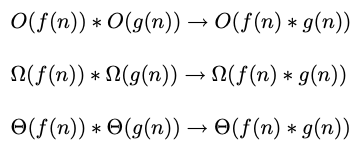
    <figcaption>Source: The Algorithm Design Manual (Page 41), Steven S. Skiena</figcaption>
</figure>

## Reasoning About Efficiency:
- ***‘Efficiency Reasoning’*** is is the breakdown analysis of the worst case (Big Oh) performance of an algorithm mathematically
- Example:
<figure>
    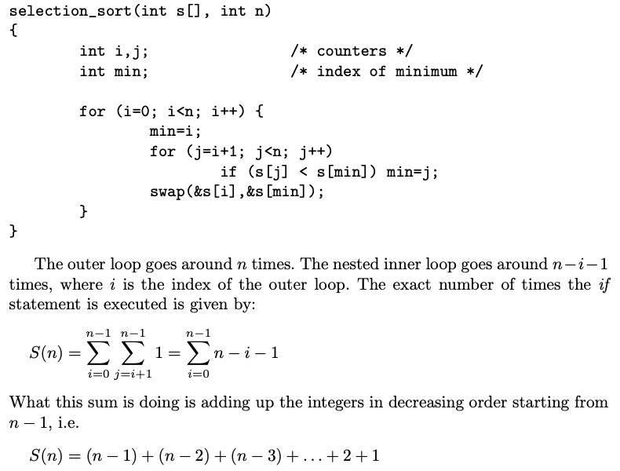
    <figcaption>Source: The Algorithm Design Manual (Page 42), Steven S. Skiena</figcaption>
    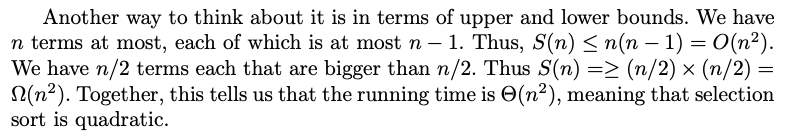
    <figcaption>Source: The Algorithm Design Manual (Page 43), Steven S. Skiena</figcaption>
</figure>

## Logarithmic Runtimes:
- ***‘Logarithms’*** are the _INVERSE_ of exponential functions & thus grow slowly
- ***RULE***: ***b^x=y*** is the _SAME_ as ***x=logb(y)***
    - ***‘b’*** is the _BASE_
    - ***‘x’*** is the _EXPONENT_
- ***ALGORITHMS***: logarithmic problems typically appear where a variable is _REPEATEDLY_ divided or multiplied by the factor of the _BASE_ (i.e. commonly base 2)
<figure>
    
    <figcaption>Source: <a href="https://people.richland.edu/james/lecture/m116/logs/logs.html">richland.edu</a></figcaption>
</figure>

### Logarithmic Rules:
<figure>
    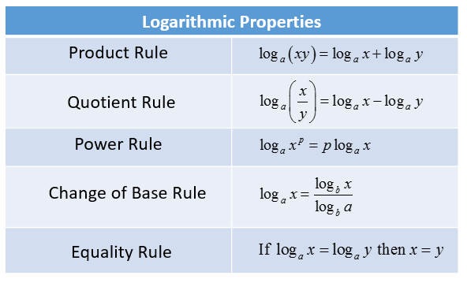
    <figcaption>Source: <a href="https://www.onlinemathlearning.com/logarithms-product-rule.html">OnlineMathLearning.com</a></figcaption>
</figure>

### Common Logarithmic Powers:
<table>
    <tr>
        <th scope="col">BASE:</th>
        <th scope="col">EXAMPLES:</th>
    </tr>
    <tr>
        <td>Binary Logarithm <b>(b = 2)</b></td>
        <td>Binary search, tree nodes, etc</td>
    </tr>
    <tr>
        <td>Natural Logarithm <b>(b = e ≈ 2.718)</b></td>
        <td>Denoted by <b>ln(n)</b></td>
    </tr>
    <tr>
        <td>Common Logarithm <b>(b = 10)</b></td>
        <td>Common for manual calculations</td>
    </tr>
</table>
 

### Logarithms & Algorithmic Observations:
- The _BASE_ of a logarithm has _NO_ impact on the runtime _GROWTH RATE_
- Logarithmic _POWER_ rule significantly reduces the runtime of any problem of input size ***n^x***
<figure>
    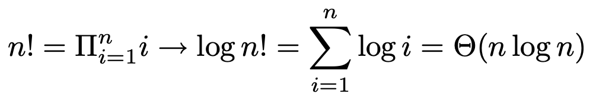
    <figcaption>Source: The Algorithm Design Manual (Page 51), Steven S. Skiena</figcaption>
</figure>