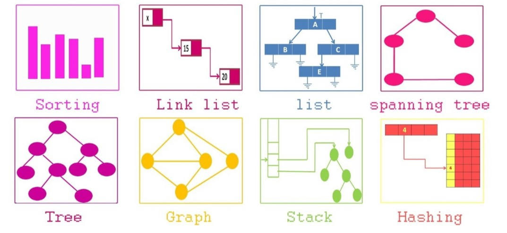
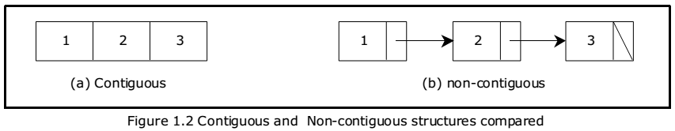

# DATA STRUCTURES

## Directory Contents:
1) [Navigation](#navigation)
2) [Defining Data Structures](#defining-data-structures)
3) [Contiguous Versus Linked Data structures](#contiguous-versus-linked-data-structures)

### Navigation:
1. [Arrays](https://github.com/Zero-Luminance/ads-c/tree/main/data-structures/arrays):
    - Fixed
    - Dynamic
    - Circular
2. [Linked Lists](https://github.com/Zero-Luminance/ads-c/tree/main/data-structures/linked-lists):
    - Singly (SLL)
    - Doubly (DLL)
    - Circular (CLL)
3. [Stacks & Queues](https://github.com/Zero-Luminance/ads-c/tree/main/data-structures/stacks-and-queues)
4. [Dictionaries](https://github.com/Zero-Luminance/ads-c/tree/main/data-structures/dictionaries)

### Defining Data Structures:
- ***‘Data Structures’*** involves methods of storing data so as to enable efficient ways of accessing or modifying said data
- ***‘Abstract Data Type’*** is a blueprint description of a data structure but does NOT specify an implementation
    - Example: Stack & Queue (store set of items), Dictionary (look up item by key), & containers
- ***‘Concrete Data Structure’*** are implementations of abstract data types
    - Example: dynamic array, linked lists, binary search trees, etc

### Contiguous Versus Linked Data Structures:
- ***‘Contiguous’*** data structures are _SINGLE SLABS_ of memory & includes arrays, matrices, heaps & hash maps 
- ***‘Linked’*** data structures are _DISTINCT CHUNKS_ of memory linked by pointers & includes lists, trees, graph adjacent lists, etc

