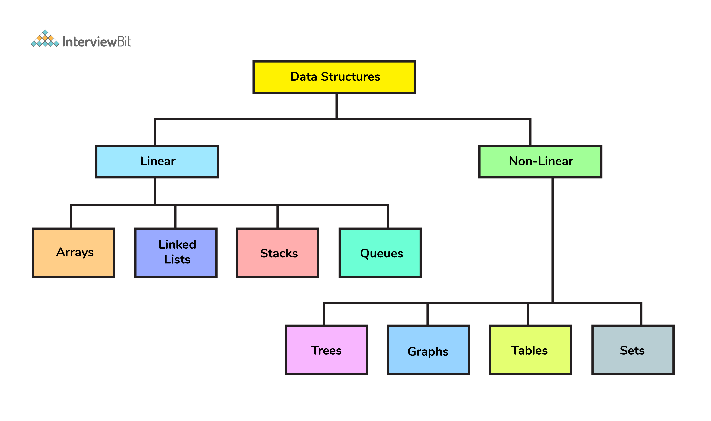

# DATA STRUCTURES

## Defining Data Structures:
- ‘Data Structures’ involves methods of storing data so as to enable efficient ways of accessing or modifying said data
- ‘Abstract Data Type’ is a blueprint description of a data structure but does NOT specify an implementation
    - Example: Stack & Queue (store set of items), Dictionary (look up item by key), & containers
- ‘Concrete Data Structure’ are implementations of abstract data types
    - Example: dynamic array, linked lists, binary search trees, etc

Contiguous Versus Linked Data Structures:
- ‘Contiguous’ data structures are SINGLE SLABS of memory & includes arrays, matrices, heaps & hash maps 
- ‘Linked’ data structures are DISTINCT CHUNKS of memory linked by pointers & includes lists, trees, graph adjacent lists, etc