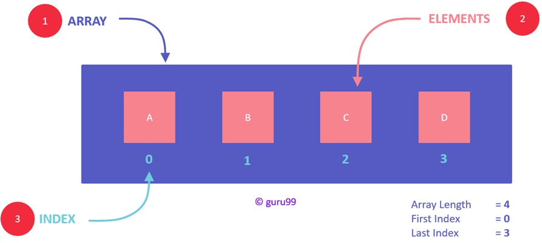
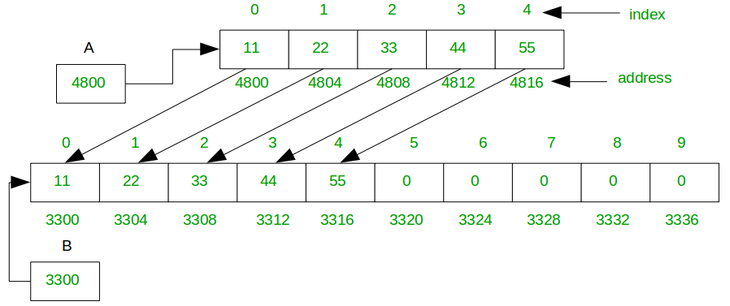
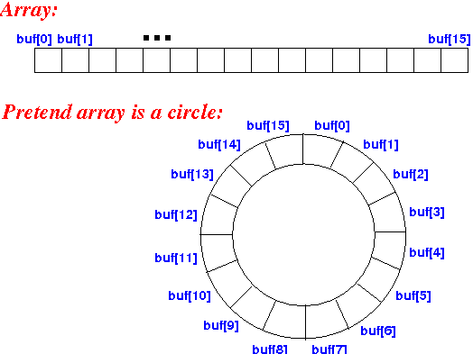

# ARRAYS

## Directory Contents:
1) [Array Implementations](#array-implementations)
2) [Defining Arrays](#defining-arrays)
3) [Fixed Arrays](#fixed-arrays)
4) [Dynamic Arrays](#dynamic-arrays)
5) [Circular Arrays](#circular-arrays)

### Array Implementations:
- [Static](https://github.com/Zero-Luminance/ads-c/blob/main/data-structures/arrays/fixed-array.c)
- [Dynamic](https://github.com/Zero-Luminance/ads-c/blob/main/data-structures/arrays/dynamic-array.c)
- [Circular](https://github.com/Zero-Luminance/ads-c/tree/main/data-structures/arrays/circular-array-files)

### Defining Arrays:
- ***‘Arrays’*** are contiguous blocks of allocated memory of size ***’n’***, where each block is accessed through an _INDEX_ or _ADDRESS_
- Types Of Arrays: Fixed, Dynamic, Circular, etc
<figure>
    
    <figcaption>Source: <a href="https://www.guru99.com/array-data-structure.html">guru99.com</a></figcaption>
</figure>
<table>
    <tr>
        <th scope="col">ADVANTAGES:</th>
        <th scope="col">DISADVANTAGES:</th>
    </tr>
    <tr>
        <td>Constant Time: O(1) access given the index</td>
        <td>Fixed arrays cannot be adjusted in size</td>
    </tr>
    <tr>
        <td>Space Efficiency: only need to know array size to make use of it</td>
        <td>Re-adjusting dynamic arrays sizes leads to the wasteful procedure of recopying items into the larger array; the total amount of movements, <b>M = 2n</b></td>
    </tr>
    <tr>
        <td>Memory Locality: refers to the adjacency between memory blocks which allows easy looping</td>
        <td>&nbsp</td>
    </tr>
</table>
 

### FIXED ARRAYS:
- ***‘Fixed Arrays’*** are arrays declared with a _SET_ side that remains _UNCHANGEABLE_ throughout program execution
- Runtimes:
<table>
    <tr>
        <th scope="col" colspan="2">OPERATION:</th>
        <th scope="col">COST & REASON:</th>
    </tr>
    <tr>
        <th scope="row"><i>RANDOM</i></th>
        <th scope="row" rowspan="3">INSERTION</th>
        <td><b>O(n)</b> - as insertion could be at the back, i.e. O(1), or anywhere else being O(n); we take the worst case</td>
    </tr>
    <tr>
        <th scope="row"><i>FRONT</i></th>
        <td><b>O(n)</b> - as subsequent element need to be shifted ’n’ times upwards to accomodate the insertion</td>
    </tr>
    <tr>
        <th scope="row"><i>BACK</i></th>
        <td><b>O(1)</b> - as the data can be directly inserted at the back using the array index</td>
    </tr>
    <tr>
        <th scope="row"><i>RANDOM</i></th>
        <th scope="row" rowspan="2">DELETION</th>
        <td><b>O(n)</b> - similar to RANDOM insertion explanation</td>
    </tr>
    <tr>
        <th scope="row"><i>FRONT</i></th>
        <td><b>O(n)</b> - similar to FRONT insertion</td>
    </tr>
    <tr>
        <th scope="row"><i>UNSORTED</i></th>
        <th scope="row" rowspan="2">SEARCHING</th>
        <td><b>O(n)</b> - as we are forced to search the entire array</td>
    </tr>
    <tr>
        <th scope="row"><i>SORTED</i></th>
        <td><b>O(ln(n))</b> - as we can use binary search to recursively cut our search range in half after</td>
    </tr>
</table>
<figure>
    
    <figcaption>Source: <a href="https://beginnersbook.com/2018/10/data-structure-array/">beginnersbook.com</a></figcaption>
</figure>
 

### DYNAMIC ARRAYS:
- ***‘Dynamic Arrays’*** or ***‘Array Lists’*** permits the declared array size to be _INCREASED_ during program execution in the event of no-space
- ***‘Logical Size’*** refers to the number of elements a dynamic array has recorded
- ***‘Physical Size’*** refers to the overall size of the array

Methodology Copying Operation:
1) Declare the array & it’s physical size
2) Keeping adding new elements until the logical size equals the physical size
3) Create a new array who’s physical size is a geometric factor of _(typically double the size)_ of the old array’s physical size
4) Transfer the contents of the old array to the new array
- NOTE: Increasing the physical size of an array by a geometric factor ensures that the ***‘copy’*** operation amortises _(averages)_ to a cost of ***O(1)***
<figure>
    
    <figcaption>Source: <a href="https://www.geeksforgeeks.org/how-do-dynamic-arrays-work/">GeeksforGeeks</a></figcaption>
</figure>

### CIRCULAR ARRAYS:
- ***‘Circular Arrays’*** involves having the _FIRST_ element adjacent to the _LAST_ element
- Given _GAPS_ in the circular array, elements can be safely traversed by visiting the ***(i%n)th*** element where:
    - ***‘i’*** indicates the current index in the iteration
    - ***’n’*** is the circular array’s physical size
- _ADVANTAGE_: ***O(n)*** time to traverse elements & ***O(1)*** memory space
<figure>
    
    <figcaption>Source: <a href="http://www.mathcs.emory.edu/~cheung/Courses/171/Syllabus/8-List/array-queue2.html">mathcs.emory.edu</a></figcaption>
</figure>