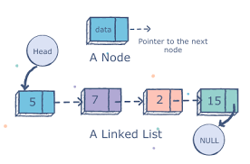
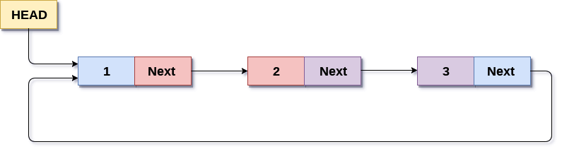

# LINKED LISTS

## Directory Contents:
1) [Introduction](#introduction)
2) [Singly Linked Lists (SLL)](#singly-linked-lists)
    -  [SLL Operation Runtimes](#sll-operation-runtimes)
3) [Doubly Linked Lists (DLL)](#doubly-linked-lists)
    -  [DLL Operation Runtimes](#dll-operation-runtimes)
4) [Circular Linked Lists (CLL)](#circular-linked-lists)
5) [Comparing Arrays & Linked Lists](#comparing-arrays--linked-lists)

## Introduction:
- ‘Linked Lists’ are a sequence of nodes containing:
    - Pointers to OTHER nodes (or NULL if end of sequence)
    - INFORMATION of any valid data type (e.g. int, double, etc)
- ‘Head’ is the FIRST node
- ‘Tail’ or ‘Foot’ is the LAST node
- BASIC OPERATIONS: searching, insertion, & deletion
- Variations: singly linked lists, doubly linked lists, circular linked lists
- Other Implementations: Stacks, Queues, Dictionaries, etc...
<figure>
    
    <figcaption>Source: <a href="https://www.educative.io/edpresso/what-is-a-linked-list">educative.io</a></figcaption>
</figure>
 

## SINGLY LINKED LISTS:
- ‘Singly Linked Lists’ (SLL) only contain a SINGLE pointer variable that points to the NEXT node in the sequence
- Diagram:
<figure>
    
    <figcaption>Source: <a href="https://www.geeksforgeeks.org/data-structures/linked-list/">GeeksforGeeks</a></figcaption>
</figure>
 

### SLL Operation Runtimes:
- NOTE: runtimes depend on the implementation (e.g. having a LIST ‘tail’ pointer would make BACK insertion & deletion O(1) constant time)
<table>
    <tr>
        <th scope="col" colspan="2">OPERATION:</th>
        <th scope="col">COST & OPERATION:</th>
    </tr>
    <tr>
        <th scope="row"><i>RANDOM</i></th>
        <th scope="row" rowspan="3">INSERTION</th>
        <td><b>O(n)</b> - need to traverse the ENTIRE SLL</td>
    </tr>
    <tr>
        <th scope="row"><i>FRONT</i></th>
        <td><b>O(1)</b> - access header pointer</td>
    </tr>
    <tr>
        <th scope="row"><i>BACK</i></th>
        <td><b>O(n)</b> - same reason as random insertion</td>
    </tr>
    <tr>
        <th scope="row"><i>RANDOM</i></th>
        <th scope="row" rowspan="2">DELETION</th>
        <td><b>O(n)</b> - same as reason as random insertion</td>
    </tr>
    <tr>
        <th scope="row"><i>FRONT</i></th>
        <td><b>O(1)</b> - same reason as front insertion</td>
    </tr>
    <tr>
        <th scope="row"><i>UNSORTED</i></th>
        <th scope="row" rowspan="2">SEARCHING</th>
        <td rowspan="2"><b>O(n)</b> - sorted or unsorted does NOT matter, worst case requires the traversal of the ENTIRE SLL (i.e. data not found in SLL)</td>
    </tr>
    <tr>
        <th scope="row"><i>SORTED</i></th>
    </tr>
</table>
 

## DOUBLY LINKED LISTS:
- ‘Doubly Linked Lists’ (DLL) contain TWO pointer variables that refer to the current node’s NEXT & PREVIOUS nodes
- Diagram:
<figure>
    
    <figcaption>Source: <a href="https://www.geeksforgeeks.org/doubly-linked-list/">GeeksforGeeks</a></figcaption>
</figure>
 

### DLL Operation Runtimes:
<table>
    <tr>
        <th scope="col" colspan="2">OPERATION:</th>
        <th scope="col">COST & REASON:</th>
    </tr>
    <tr>
        <th scope="row" rowspan="2"><i>BACK</i></th>
        <th scope="row">INSERTION</th>
        <td rowspan="2"><b>O(1)</b> - access tail pointer (assuming it has been implementation in the list code)</td>
    </tr>
    <tr>
        <th scope="row"><i>DELETION</i></th>
    </tr>
</table>
 

## CIRCULAR LINKED LISTS:
- ‘Circular Linked Lists’ (CLL) requires the TAIL node’s pointer to point BACK to the HEAD node (or vice versa if doubly too)
- Diagram:
<figure>
    
    <figcaption>Source: <a href="https://www.javatpoint.com/circular-singly-linked-list">javaTpoint</a></figcaption>
</figure>
 

## Comparing Arrays & Linked Lists
<table>
    <tr>
        <th scope="col">STATIC ARRAY ADVANTAGES:</th>
        <th scope="col">LINKED LIST ADVANTAGES:</th>
    </tr>
    <tr>
        <td>Implementation requires <i>LESS</i> space</td>
        <td>Overflow only occurs due to a <i>LACK</i> of memory</td>
    </tr>
    <tr>
        <td>Can <i>ACCESS</i> items <i>DIRECTLY</i></td>
        <td>Easier to <i>INSERT</i> & <i>DELETE</i> items</td>
    </tr>
    <tr>
        <td>Better memory locality & cached performance</td>
        <td><i>EASIER</i> & <i>FASTER</i> to move pointers instead of shifting entire array items</td>
    </tr>
</table>