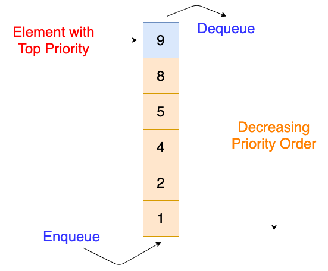
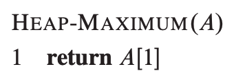
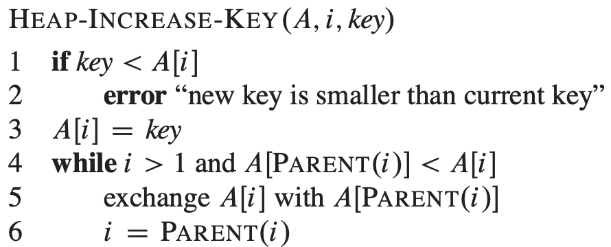
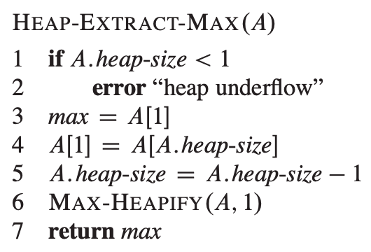
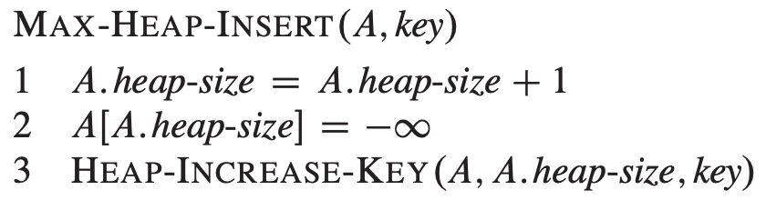

# PRIORITY QUEUES

## Directory Contents:
1) [Priority Queue Implementations](#priority-queue-implementations)
2) [Priority Queue Introduction](#priority-queue-introduction)
3) [Types Of Priority Queues](#types-of-priority-queues)
4) [Operations For Priority Queues](#operations-for-priority-queues)
5) [Complexity Costs Of Priority Queue Operations](#complexity-costs-of-priority-queue-operations)
6) [Maximum Priority Queue Array Pseudo-Code](#maximum-priority-queue-array-pseudo-code)

## Priority Queue Implementations:
- [Binary Heaps](https://github.com/Zero-Luminance/ads-c/tree/main/data-structures/priority-queues/binary-heap-files)
- [Array Dictionary]()
- [Singly Linked List Dictionary (SLLD)]()

## Priority Queue Introduction:
- ***‘Priority Queues’*** is an ABSTRACT data structure that operates similar to a queue BUT assigns a PRIORITY value to each item
- ***‘Priority Value’*** or ***‘Key’*** dictates which elements leave the queue first; HIGHER priority corresponds to EARLIER removal
- NOTE: can only be implemented with data that is COMPARABLE

## Types Of Priority Queues:
- ***‘Maximum (MAX) Priority Queue’*** assigns items with HIGHER keys to have HIGHER priority (see image below)
- ***‘Minimum (MIN) Priority Queue’*** assigns items with LOWER keys to have HIGHER priority
<figure>
    
    <figcaption>Source: <a href="https://afteracademy.com/blog/priority-queues">AfterAcademy</a></figcaption>
</figure>

## Operations For Priority Queues:
<table>
    <tr>
        <th scope="col">PRIORITY QUEUE OPERATION:</th>
        <th scope="col">DESCRIPTION:</th>
    </tr>
    <tr>
        <th scope="row">Insert(Q, x)</th>
        <td>Inserts an new item ‘x’ at the BACK of the priority queue, 'Q’</td>
    </tr>
    <tr>
        <th scope="row">Find-Minimum(Q) or Find-Maximum(Q)</th>
        <td>Returns the item in the priority queue, ‘Q’, with the LOWEST or HIGHEST key</td>
    </tr>
    <tr>
        <th scope="row">Delete-Minimum(Q) or Delete-Maximum(Q)</th>
        <td>Delete the item at the FRONT (i.e. the item with the HIGHEST key value) of the priority queue, ‘Q'</td>
    </tr>
    <tr>
        <th scope="row">Decrease-Key(S, x, k) or Increase(Q, x, k)</th>
        <td>DECREASES or INCREASES an existing item ‘x’ in the priority queue, ‘Q’, with a new key value of ‘k’</td>
    </tr>
</table>
 

## Complexity Costs Of Priority Queue Operations:
<table>
    <tr>
        <th scope="col">COST & DATA STRUCTURE:</th>
        <th scope="col">Unsorted Array:</th>
        <th scope="col">Sorted Array:</th>
        <th scope="col">Balanced Tree:</th>
    </tr>
    <tr>
        <th scope="row">Insert(Q, x)</th>
        <td rowspan="2">O(1)</td>
        <td>O(n)</td>
        <td>O(logn)</td>
    </tr>
    <tr>
        <th scope="row">Find-Minimum(Q) or Find-Maximum(Q)</th>
        <td rowspan="2">O(1)</td>
        <td>O(1)</td>
    </tr>
    <tr>
        <th scope="row">Delete-Minimum(Q) or Delete-Maximum(Q)</th>
        <td>O(1)</td>
        <td>O(logn)</td>
    </tr>
</table>
 

## Maximum Priority Queue Array Pseudo-Code:
<figure>
    <table>
        <tr>
            <td></td>
            <td></td>
        </tr>
        <tr>
            <td></td>
            <td></td>
        </tr>
    </table>
    <figcaption>Source: <a href="https://mitpress.mit.edu/books/introduction-algorithms-third-edition">Introduction To Algorithms 3rd Edition (Pages 163 & 164)</a></figcaption>
</figure>
 