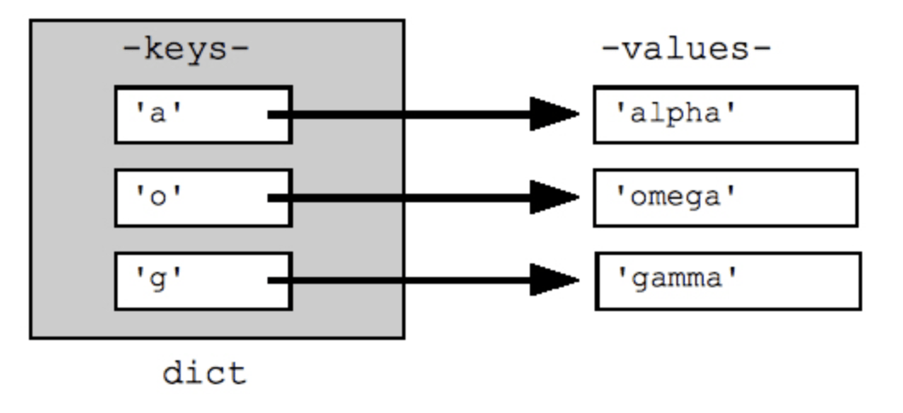
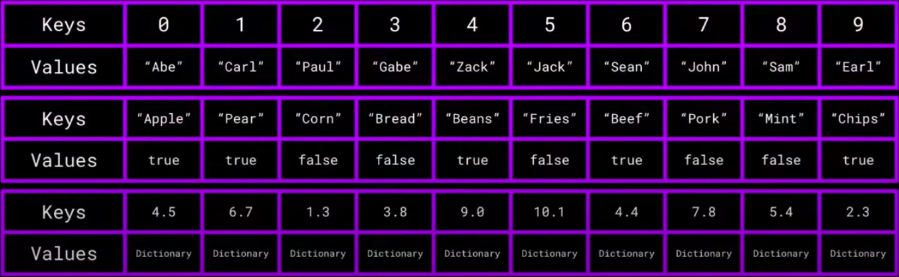
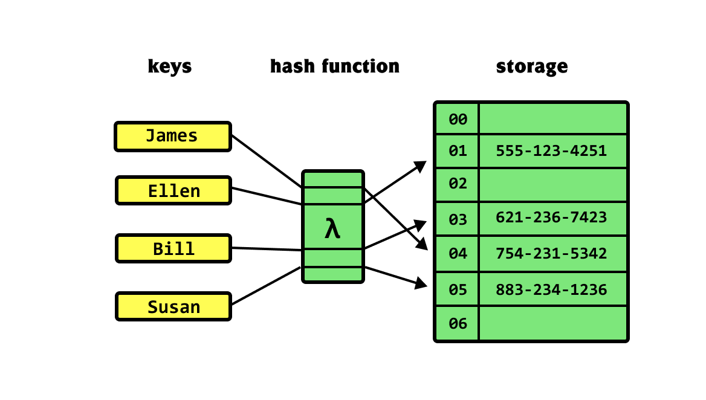

# SETS & DICTIONARIES

## Directory Contents:
1) [Dictionary Implementations](#dictionary-implementations)
2) [Sets](#sets)
3) [Dictionaries](#dictionaries)
    - [Dictionary Properties](#dictionary-properties)
    - [Dictionary Operation](#dicionary-operations)
    - [Runtimes For Dictionary Arrays](#runtimes-for-dictionary-arrays)
    - [Runtimes For Dictionary Linked Lists](#runtimes-for-dictionary-linked-lists)
    - [Introduction To Hash Tables](#introduction-to-hash-tables)

## Dictionary Implementations:
- [Hash Tables](https://github.com/Zero-Luminance/ads-c/tree/main/data-structures/sets-and-dictionaries/hash-table-files)
- [Array Dictionary]()
- [Singly Linked List Dictionary (SLLD)]()

## Sets:
- ***‘Set’*** is an _ABSTRACT_ data type that stores _UNIQUE_ values _WITHOUT_ any _ORDER_; a computer science implementation of a mathematical finite set
- ***‘Dynamic Sets’*** are sets that that _GROW_ or _SHRINK_ over time & has the following _TYPES_ of _OPERATIONS_:
    - ***‘Queries’*** return information about a set
    - ***‘Modifying Operations’*** change the values in a set
- _SET IMPLEMENTATIONS:_ stacks, queues, dictionaries, linked lists, rooted trees, binary trees, AVL trees, red black trees, etc

### Operations On A Dynamic Set:
<table>
    <tr>
        <th scope="col">OPERATION:</th>
        <th scope="col">DESCRIPTION:</th>
    </tr>
    <tr>
        <th scope="row">Search(S, k)</th>
        <td>Given a KEY ‘k’, return a POINTER to the corresponding element in the SET ’S’ if it exists</td>
    </tr>
    <tr>
        <th scope="row">Insert(S, x)</th>
        <td>Given a DATA ITEM ‘x’, add it to the SET ’S’</td>
    </tr>
    <tr>
        <th scope="row">Delete(S, x)</th>
        <td>Given a pointer to a given DATA ITEM ‘x’ in the SET ’S’ & REMOVE it</td>
    </tr>
    <tr>
        <th scope="row" colspan="2">EXTRA OPERATIONS:</th>
    </tr>
    <tr>
        <th scope="row">Max(S) or Min(S)</th>
        <td>Return the item with the LARGEST/SMALLEST KEY in SET ‘S’</td>
    </tr>
    <tr>
        <th scope="row">"Predecessor(S, k) or Successor(S, k)"</th>
        <td>Return the item from SET ’S’ whose key  is immediately BEFORE/AFTER the KEY ‘k’ in SORTED order; provides a mechanism for iteration</td>
    </tr>
</table>
 

## Dictionaries:
- ***‘Dictionaries’*** (a.k.a. ‘maps’ or ‘associative arrays’) is an _ABSTRACT_ data type & type of _DYNAMIC SET_ where data is accessed/indexed using keys; ***‘key-value’*** _PAIR_ relationship
- _MANDATORY OPERATIONS:_ search(D, k), Insert(D, x) & Delete(D, x)
<figure>
    
    <figcaption>Source: <a href="https://www.datacamp.com/tutorial/python-dictionaries">datacamp</a></figcaption>
</figure>

### Dictionary Properties:
- ***‘Keys’*** can be of any _PRIMITIVE_ data type
- ***‘Values’*** can be ANY data type or data structure
- Each key has a _UNIQUE_ value (i.e. no duplicates)
- Each key _CORRESPONDS_ to ONLY ONE value
<figure>
    
    <figcaption>Source: <a href="https://www.youtube.com/watch?v=j0cPnbtp1_w">NullPointer Exception (YouTube)</a></figcaption>
</figure>

### Dicionary Operations:
<table>
    <tr>
        <th scope="col"></th>
        <th scope="col"></th>
    </tr>
    <tr>
        <th scope="row">Search(D, k)</th>
        <td>Given a key, ‘k’, RETURN a value from the dictionary, ‘D’, if it exists</td>
    </tr>
    <tr>
        <th scope="row">Insert(D, x)</th>
        <td>Given a new item ‘x’, add it to the dictionary ‘D’</td>
    </tr>
    <tr>
        <th scope="row">Delete(D, x)</th>
        <td>Given an item ‘x’, delete it if it is found in the dictionary, ‘D’</td>
    </tr>
    <tr>
        <th scope="row">Min(D) or Max(D)</th>
        <td>Retrieve the item with the SMALLEST or LARGEST key in dictionary, ‘D’</td>
    </tr>
    <tr>
        <th scope="row">Predecessor(D, k) or Successor(D, k)</th>
        <td>Retrieve the PREVIOUS or NEXT item found BEFORE or AFTER the key ‘k’, in the dictionary, ‘D’</td>
    </tr>
</table>
 

### Runtimes For Dictionary Arrays:
- Given an _ARRAY_ ***‘A’*** of _SIZE_ ***’n’*** elements, & new _ITEM_ ***‘x'***
- ***‘✱’*** (Array Unsorted: Deletion ***O(n)***) write over the deleted item at it’s index with the _LAST_ element, n - 1, & then decrementing ***’n’*** by 1
<table>
    <tr>
        <th scope="col">DICTIONARY ARRAY OPERATION:</th>
        <th scope="col">UNSORTED ARRAY:</th>
        <th scope="col">SORTED ARRAY:</th>
    </tr>
    <tr>
        <th scope="row">Search(A, k)</th>
        <td>O(n)</td>
        <td>O(logn)</td>
    </tr>
    <tr>
        <th scope="row">Insert(A, x)</th>
        <td>O(1)</td>
        <td rowspan="2">O(n)</td>
    </tr>
    <tr>
        <th scope="row">Delete(A, x)</th>
        <td>O(1)*</td>
    </tr>
    <tr>
        <th scope="row">Successor(A, x)</th>
        <td rowspan="4">O(n)</td>
        <td rowspan="4">O(1)</td>
    </tr>
    <tr>
        <th scope="row">Predecessor(A, x)</th>
    </tr>
    <tr>
        <th scope="row">Minimum(A)</th>
    </tr>
    <tr>
        <th scope="row">Maximum(A)</th>
    </tr>
</table>
 

### Runtimes For Dictionary Linked Lists:
<table>
    <tr>
        <th scope="col">DICTIONARY LINKED LIST OPERATION:</th>
        <th scope="col">SINGLY UNSORTED:</th>
        <th scope="col">DOUBLY UNSORTED:</th>
        <th scope="col">SINGLY SORTED</th>
        <th scope="col">DOUBLY SORTED</th>
    </tr>
    <tr>
        <th scope="row">Search(L, k)</th>
        <td colspan="2">O(n)</td>
        <td rowspan="2" colspan="2">O(n)</td>
    </tr>
    <tr>
        <th scope="row">Insert(L, x)</th>
        <td>O(1)</td>
        <td rowspan="2">O(1)</td>
    </tr>
    <tr>
        <th scope="row">Delete(L, x)</th>
        <td>O(n)*</td>
        <td>O(n)*</td>
        <td rowspan="5">O(1)</td>
    </tr>
    <tr>
        <th scope="row">Successor(L, x)</th>
        <td rowspan="4" colspan="2">O(n)</td>
        <td>O(1)</td>
    </tr>
    <tr>
        <th scope="row">Predecessor(L, x)</th>
        <td>O(n)*</td>
    </tr>
    <tr>
        <th scope="row">Minimum(L)</th>
        <td rowspan="2">O(1)</td>
    </tr>
    <tr>
        <th scope="row">Maximum(L)</th>
    </tr>
</table>
 

### Introduction To Hash Tables:
- ***‘Hash Function’*** uses an algorithm that converts/maps keys into indexes that are used to access their corresponding value
- ***‘Hash Table’*** _(i.e. storage in the diagram below)_ is an array that relies on keys to access it’s values
- ***‘Collision’*** occurs when two or more keys map to the _SAME_ index
<figure>
    
    <figcaption>Source: <a href="https://khalilstemmler.com/blogs/data-structures-algorithms/hash-tables/">khalilstemmler.com</a></figcaption>
</figure>