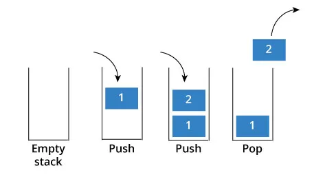
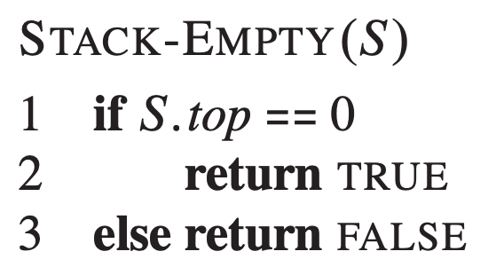
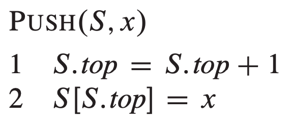
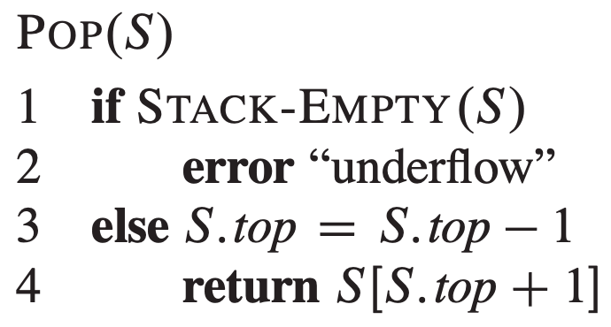
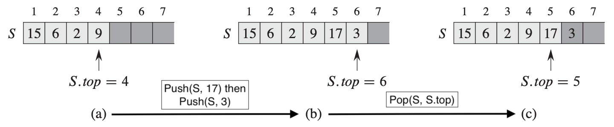
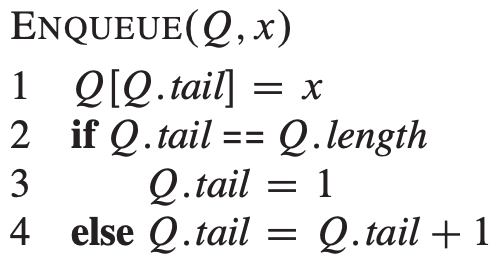
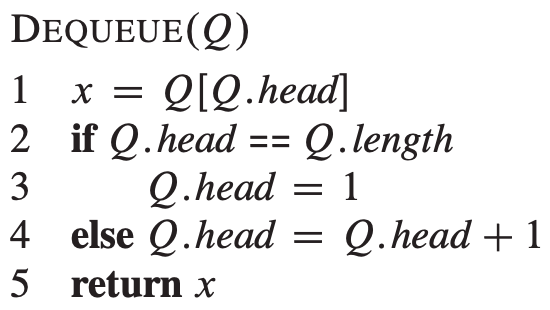
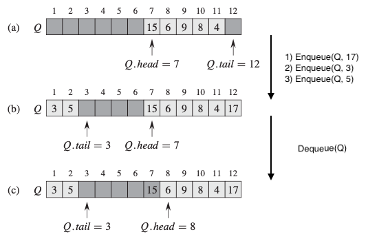

# STACKS & QUEUES

## Directory Contents:
1) [Stacks & Queues Implementations](#stacks--queues-implementations)
2) [Containers](#containers)
3) [Stacks](#stacks-lifo)
4) [Queues](#queues-fifo)
5) [Example Implementations (Not Limited To) For Stacks & Queues](#example-implementations-not-limited-to-for-stacks--queues)

## Stacks & Queues Implementations:
- [Singly Linked List Stack (SLLS)](https://github.com/Zero-Luminance/ads-c/tree/main/data-structures/stacks-and-queues/singly-linked-list-stack-files)
- [Singly Linked List Queue (SLLQ)](https://github.com/Zero-Luminance/ads-c/tree/main/data-structures/stacks-and-queues/singly-linked-list-queue-files)

## Containers:
- ***‘Containers’*** refers to data structures whose instances are collections of other objects with examples such as:
<table>
    <tr>
        <th scope="col">ABSTRACT Data Types:</th>
        <th scope="col">CONCRETE Data Types:</th>
    </tr>
    <tr>
        <td>- FIFO Queues</td>
        <td>- Arrays</td>
    </tr>
    <tr>
        <td>- LIFO Stacks</td>
        <td>- Linked Lists</td>
    </tr>
    <tr>
        <td>- Priority Queues</td>
        <td>- Binary Search Trees</td>
    </tr>
    <tr>
        <td>- Priority Queues</td>
        <td>- Hash Tables</td>
    </tr>
    <tr>
        <td>- Lookup Tables</td>
        <td>&nbsp</td>
    </tr>
    <tr>
        <td>- Key-associated data structures: sets, maps, dictionaries</td>
        <td>&nbsp</td>
    </tr>
</table>
- Container Types:
    - ***‘Single Value Continuers’*** stores data items separately & accessed via iteration
    - ***‘Associative Containers’*** uses key-value pairs to access & store data

## Stacks (LIFO):
- ***‘Stacks’*** is an _ABSTRACT_ data structure that _RETRIEVES_ items using a ***‘last-in, first-out’*** _(LIFO)_ approach
- _CIRCUMSTANCE_: order of item retrieval does NOT matter
<table>
    <tr>
        <th scope="col">STACK OPERATION:</th>
        <th scope="col">DESCRIPTION:</th>
    </tr>
    <tr>
        <th scope="row">Push(x, s)</th>
        <td>Insert item ‘x’ onto the TOP of stack ’s'</td>
    </tr>
    <tr>
        <th scope="row">Pop(s)</th>
        <td>RETURN & REMOVE the TOP item from stack ’s'</td>
    </tr>
</table>
<figure>
    
    <figcaption>Source: <a href="https://laptrinhx.com/stacks-and-queues-simplified-1889506540/">LaptrinhX</a></figcaption>
</figure>
 

### STACK (Array) Pseudo-code:
- ’S’ denotes that stack as an ARRAY
- ’S.top’ is the LOGICAL SIZE (i.e. number of elements recorded) of the array
- ’n’ denotes the PHYSICAL SIZE (i.e. maximum size) of the array
- NOTE:
    - ‘Stack Underflow’ occurs when trying to POP an EMPTY stack (i.e. S.top = 0)
    - ‘Stack Overflow’ occurs when trying to PUSH an element when S.top is GREATER than n
- ARRAY STACK OPERATION COSTS: stack-empty, push & pop are all O(1)
<figure>
    <table>
        <tr>
            <td></td>
            <td></td>
            <td></td>
        </tr>
        <tr>
            <td colspan="3"></td>
        </tr>
    </table>
    <figcaption>Source: <a href="https://www.algorist.com/">The Algorithm Design Manual</a> (Page 233), Steven S. Skiena</figcaption>
</figure>
 

## Queues (FIFO):
- ***‘Queue’*** is an _ABSTRACT_ data structure that _RETRIEVES_ items using a ***‘first-in, first-out’*** _(FIFO)_ approach
- _CIRCUMSTANCE_: order of item retrieval MATTERS
<table>
    <tr>
        <th scope="col">QUEUE OPERATION:</th>
        <th scope="col">DESCRIPTION:</th>
    </tr>
    <tr>
        <th scope="row">Enqueue(x,q)</th>
        <td>Insert item ‘x’ at the BACK of queue ‘q’</td>
    </tr>
    <tr>
        <th scope="row">Dequeue(q)</th>
        <td>RETURN & REMOVE the FRONT item from queue ‘q’</td>
    </tr>
</table>
<figure>
    
    <figcaption>Source: <a href="https://www.designveloper.com/blog/stacks-and-queues-data-structures/">Designveloper</a></figcaption>
</figure>
 

### QUEUE (Array) Pseudo-code:
- ‘Q’ denotes the queue as an ARRAY
- ’S.head’ is an INDEX used to access the FRONT/HEAD of the queue
- ’S.tail’ is an INDEX used to access the BACK/TAIL of the queue
- NOTE:
    - ‘Queue Underflow’ occurs when DEQUEUEing an EMPTY queue (Q.head == Q.tail)
    - ‘Queue Overflow’ occurs when ENQUEUEing when Q.head = Q.tail + 1
- ARRAY QUEUE OPERATION COST: enqueue, dequeue & queue-empty all O(1)
<figure>
    <table>
        <tr>
            <td></td>
            <td></td>
        </tr>
        <tr>
            <td colspan="2"></td>
        </tr>
    </table>
    <figcaption>Source: The Algorithm Design Manual (Pages 233 & 234), Steven S. Skiena</figcaption>
</figure>
 

## Example Implementations (Not Limited To) For Stacks & Queues:
<table>
    <tr>
        <th scope="col">STACKS:</th>
        <th scope="col">QUEUES:</th>
    </tr>
    <tr>
        <td colspan="2">Arrays & Linked Lists</tr>
    </tr>
    <tr>
        <td>Recursive Algorithms</td>
        <td>Breadth First Search (Graphs)</td>
    </tr>
</table>