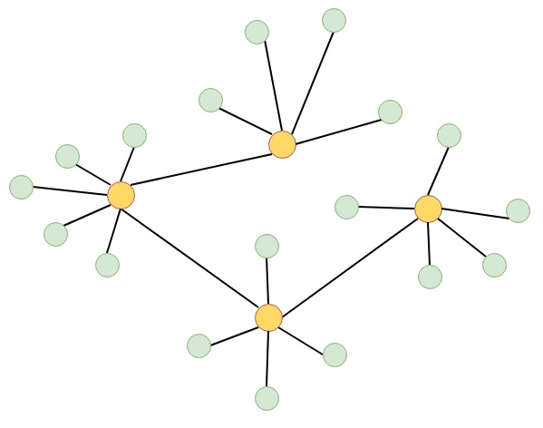
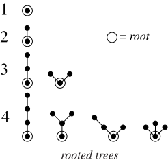
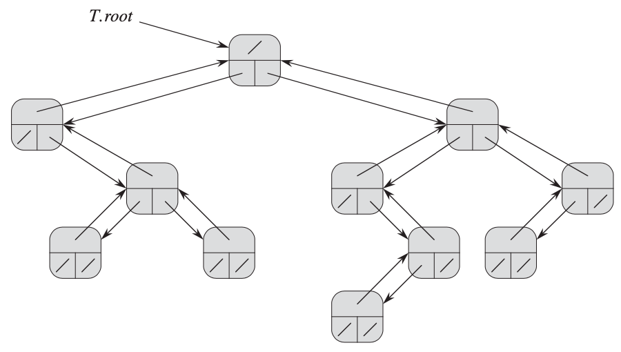
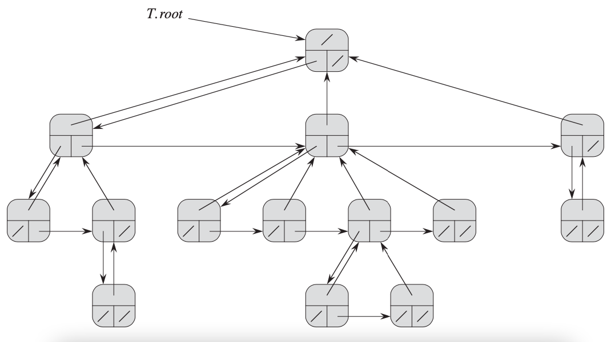

# TREES

## Directory Contents:
1) [Tree Implementations](#tree-implementations)
2) [Introduction To Trees](#introduction-to-trees)
3) [Types Of Trees](#types-of-trees)
4) [Binary Trees](#binary-trees)
5) [Unbounded Branching Trees](#unbounded-branching-trees)

## Tree Implementations:
- [Binary Search Trees (Unbalanced)](https://github.com/Zero-Luminance/ads-c/tree/main/data-structures/trees/binary-search-tree-files)
- [AVL Trees (Self-Balancing)](https://github.com/Zero-Luminance/ads-c/tree/main/data-structures/trees/avl-tree-files)
- [Red-Black Trees (Self-Balancing)](https://github.com/Zero-Luminance/ads-c/tree/main/data-structures/trees/red-black-tree-files)
- [Trie: Radix](https://github.com/Zero-Luminance/ads-c/tree/main/data-structures/trees/trie-radix-files)
- [B Trees](https://github.com/Zero-Luminance/ads-c/tree/main/data-structures/trees/b-trees)
- [Van Emde Boas Trees](https://github.com/Zero-Luminance/ads-c/tree/main/data-structures/trees/van-emde-boas-tree-files)

## Introduction To Trees:
- ***‘Trees’*** is a hierarchical _ABSTRACT_ data structure that consists of:
    - ***‘Root’*** node which is the _TOP-MOST_ node in the tree
    - ***‘Child’*** nodes extend from a parent node located _ABOVE_ it
    - ***‘Parent’*** nodes extends to other child node(s) _BELOW_ it
    - ***‘Sibling’*** nodes involves child nodes with the _SAME_ parent node
    - ***‘Leaf’*** is a node _WITHOUT_ children
    - ***‘Internal’*** nodes have _AT LEAST_ 1 child
- ***‘Degree’*** of a tree is the _NUMBER_ of child nodes
- ***‘Edge’*** is the _CONNECTION_ between nodes
- ***‘Level’*** is the _NUMBER_ of parent nodes needed to reach the root node
- ***‘Height’*** is the length of the _LONGEST_ downward path between the node & leaf
<figure>
    
    <figcaption>Source: <a href="https://www.tutorialspoint.com/data_structures_algorithms/tree_data_structure.htm">tutorialspoint</a></figcaption>
</figure>

## Types Of Trees:
- ***‘Rooted Tree’*** are trees with a singled out node called the _ROOT_ node
- ***‘Free Trees’*** are trees without a root node
<table>
    <tr></tr>
        <td>
            <figure>
                
                <figcaption>Source: <a href="https://www.tutorialspoint.com/rooted-vs-unrooted-trees-in-data-structure">tutorialspoint</a></figcaption>
            </figure>
        </td>
        <td>
            <figure>
                
                <figcaption>Source: <a href="https://mathworld.wolfram.com/RootedTree.html#:~:text=A%20rooted%20tree%20is%20a,385-399).">Wolfram MathWorld</a></figcaption>
            </figure>
        </td>
    <tr></tr>
</table>

## Binary Trees:
- ***‘Binary Trees’*** permit a _MAXIMUM_ of 2 child nodes per parent node
- Each binary tree node has:
    - _TWO_ pointers _(e.g. named ***‘left’*** & ***‘right’***)_ to potential _CHILD_ nodes
    - _ONE_ pointer to the _PARENT_ node (e.g. named ***‘p’*** or ***‘parent’***)
    - ***‘Key’*** containing _INFORMATION_ of an appropriate data type or structure
<figure>
    
    <figcaption>Source: <a href="https://mitpress.mit.edu/books/introduction-algorithms-third-edition">Introduction To Algorithms 3rd Edition (Page 247)</a></figcaption>
</figure>

## Unbounded Branching Trees:
- ***‘Unbounded Branching Trees’*** are trees that employ an ***’n’*** number of child nodes per parent node
- A ***‘Left-Child & Right-Child’*** representation uses ***O(n)*** space that requires the _PARENT_ node to _ONLY_ store a pointer for the _LEFT-MOST_ child node
<figure>
    
    <figcaption>Source: Introduction To Algorithms 3rd Edition (Page 247)</figcaption>
</figure>